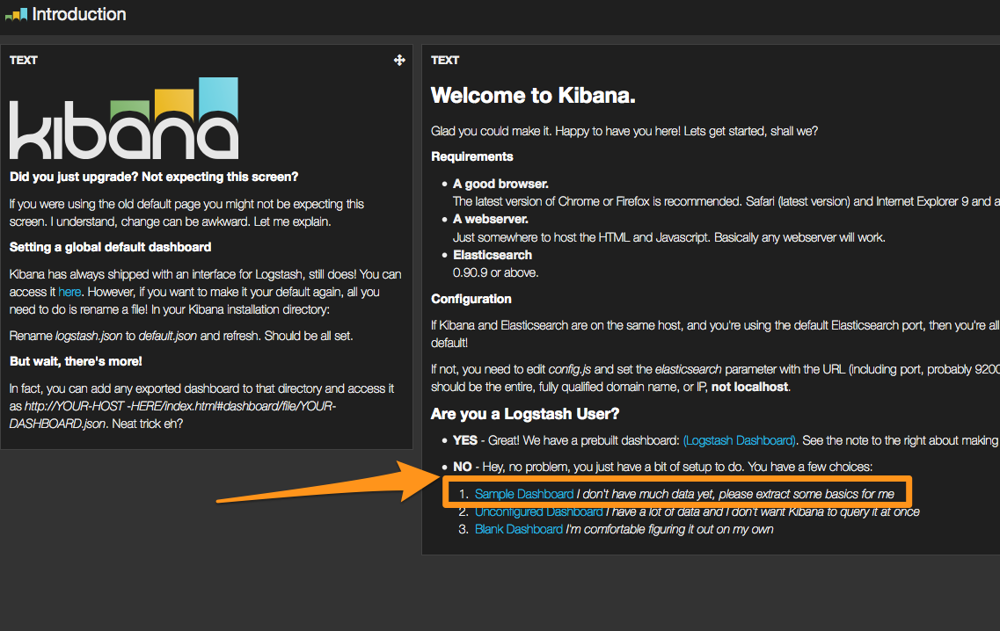
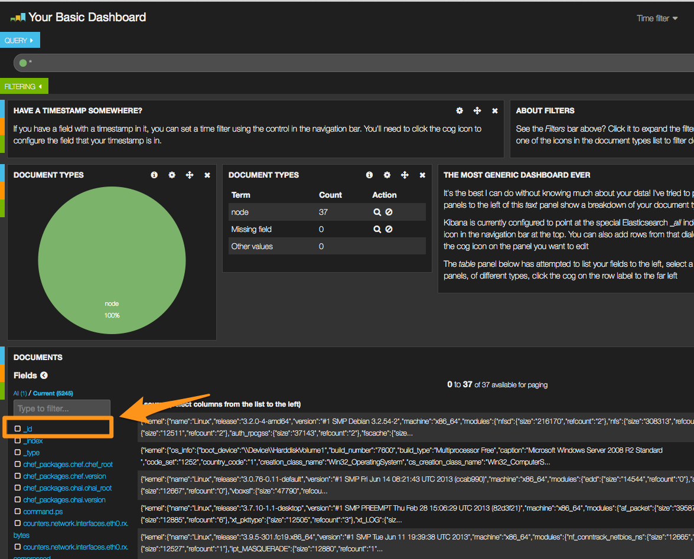
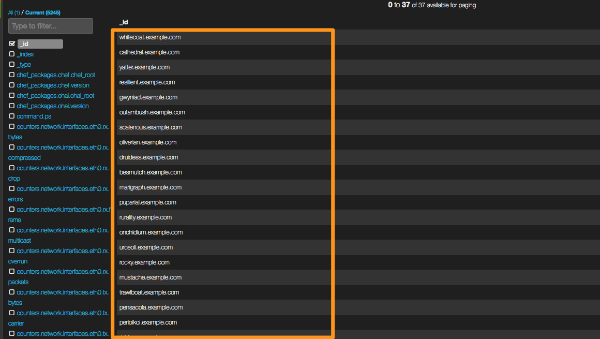
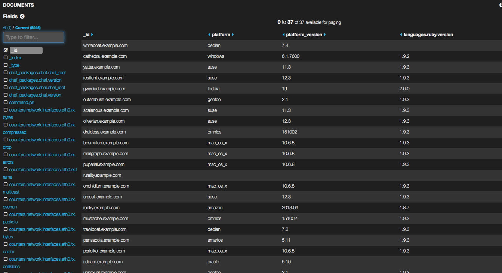

# Ohai to Elasticsearch Example

When put ohai stdout to elasticsearch, you can search all attributes with kibana.

## Rake tasks for sample

```
rake default                # Print Usage
rake down                   # stop example
rake mock:put[num]          # put ohai samples to elasticsearch defaut num=10
rake mock:test              # show sample ohai
rake prepare:all            # prepare softwares for development
rake prepare:es             # setup elasticsearch
rake prepare:kibana         # setup kibana
rake ps:es:start            # start elasticsearch
rake ps:es:stop             # stop elasticsearch
rake ps:kibana:start[port]  # start python web server default port=8000
rake up                     # start example
```

### Setup

`bundle`

### Usage

Post Samples.

`rake up`

1. Download elasticsearch and kibana.
2. Put ohai_data examples which build by fauxhai.
3. Host kibana  by SimpleHTTPServer module(Python).

Output like following...

```
-- snip --
put 30 ohai mocks to elasticsearch
Example: 'ohai | curl -XPUT http://localhost:9200/ohai/node/sextic.example.com -d @-' => suse
Example: 'ohai | curl -XPUT http://localhost:9200/ohai/node/alleyite.example.com -d @-' => suse
Example: 'ohai | curl -XPUT http://localhost:9200/ohai/node/gracioso.example.com -d @-' => freebsd
Example: 'ohai | curl -XPUT http://localhost:9200/ohai/node/fluidism.example.com -d @-' => oracle
Example: 'ohai | curl -XPUT http://localhost:9200/ohai/node/rocky.example.com -d @-' => amazon
Example: 'ohai | curl -XPUT http://localhost:9200/ohai/node/urceoli.example.com -d @-' => suse
Example: 'ohai | curl -XPUT http://localhost:9200/ohai/node/impure.example.com -d @-' => suse
Example: 'ohai | curl -XPUT http://localhost:9200/ohai/node/delouse.example.com -d @-' => redhat
Example: 'ohai | curl -XPUT http://localhost:9200/ohai/node/outambush.example.com -d @-' => gentoo
Example: 'ohai | curl -XPUT http://localhost:9200/ohai/node/sorbite.example.com -d @-' => openbsd
Example: 'ohai | curl -XPUT http://localhost:9200/ohai/node/unsexual.example.com -d @-' => gentoo
Example: 'ohai | curl -XPUT http://localhost:9200/ohai/node/ristori.example.com -d @-' => suse
Example: 'ohai | curl -XPUT http://localhost:9200/ohai/node/disseize.example.com -d @-' => windows
Example: 'ohai | curl -XPUT http://localhost:9200/ohai/node/gwyniad.example.com -d @-' => fedora
Example: 'ohai | curl -XPUT http://localhost:9200/ohai/node/anguria.example.com -d @-' => amazon
Example: 'ohai | curl -XPUT http://localhost:9200/ohai/node/riddam.example.com -d @-' => oracle
Example: 'ohai | curl -XPUT http://localhost:9200/ohai/node/herein.example.com -d @-' => fedora
Example: 'ohai | curl -XPUT http://localhost:9200/ohai/node/marigraph.example.com -d @-' => mac_os_x
Example: 'ohai | curl -XPUT http://localhost:9200/ohai/node/asaddle.example.com -d @-' => oracle
Example: 'ohai | curl -XPUT http://localhost:9200/ohai/node/onchidium.example.com -d @-' => mac_os_x
Example: 'ohai | curl -XPUT http://localhost:9200/ohai/node/resilient.example.com -d @-' => suse
Example: 'ohai | curl -XPUT http://localhost:9200/ohai/node/perioikoi.example.com -d @-' => mac_os_x
Example: 'ohai | curl -XPUT http://localhost:9200/ohai/node/yatter.example.com -d @-' => suse
Example: 'ohai | curl -XPUT http://localhost:9200/ohai/node/rurality.example.com -d @-' => 
Example: 'ohai | curl -XPUT http://localhost:9200/ohai/node/cathedral.example.com -d @-' => windows
Example: 'ohai | curl -XPUT http://localhost:9200/ohai/node/besmutch.example.com -d @-' => mac_os_x
Example: 'ohai | curl -XPUT http://localhost:9200/ohai/node/druidess.example.com -d @-' => omnios
Example: 'ohai | curl -XPUT http://localhost:9200/ohai/node/otectomy.example.com -d @-' => ubuntu
Example: 'ohai | curl -XPUT http://localhost:9200/ohai/node/whitecoat.example.com -d @-' => debian
Example: 'ohai | curl -XPUT http://localhost:9200/ohai/node/puparial.example.com -d @-' => mac_os_x
Serving HTTP on 0.0.0.0 port 8000 ...
```

#### Open kibana

Open `http://localhost:8000` to access kibana.










#### Stop Elasticsearch

`rake down`


